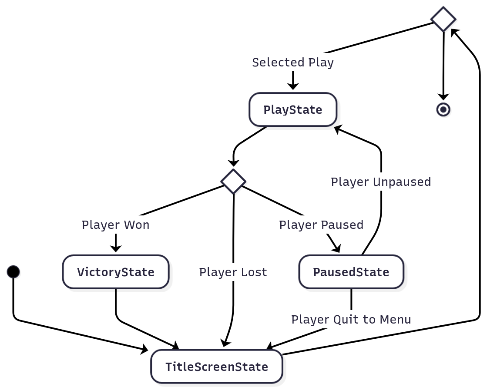
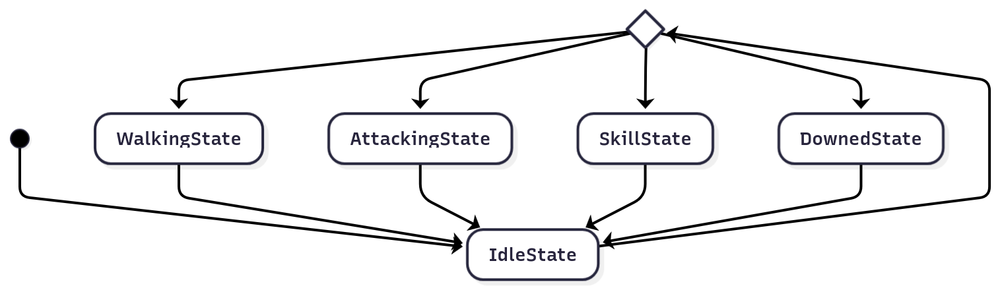
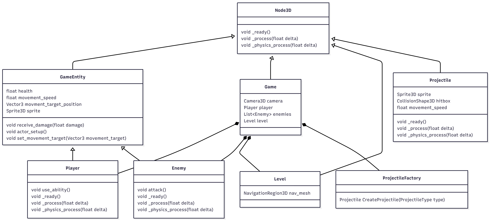
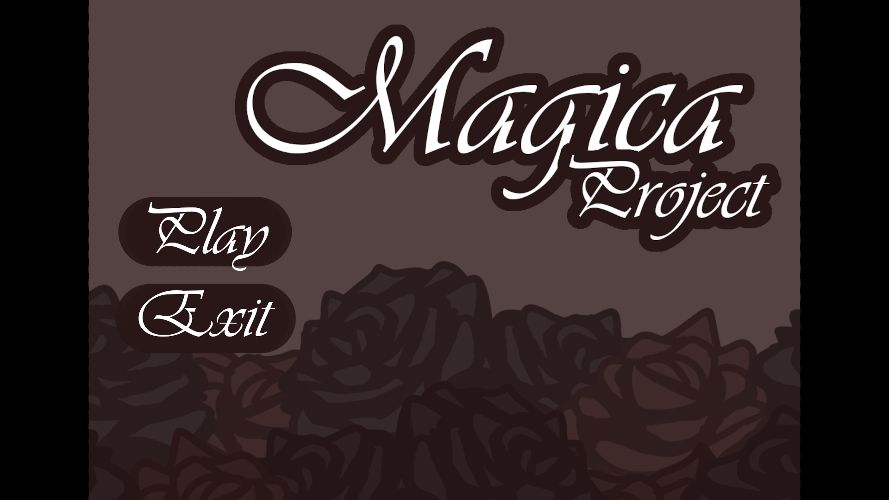
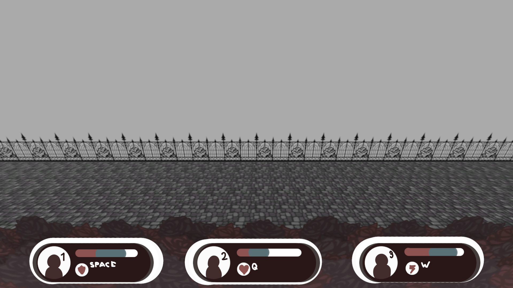
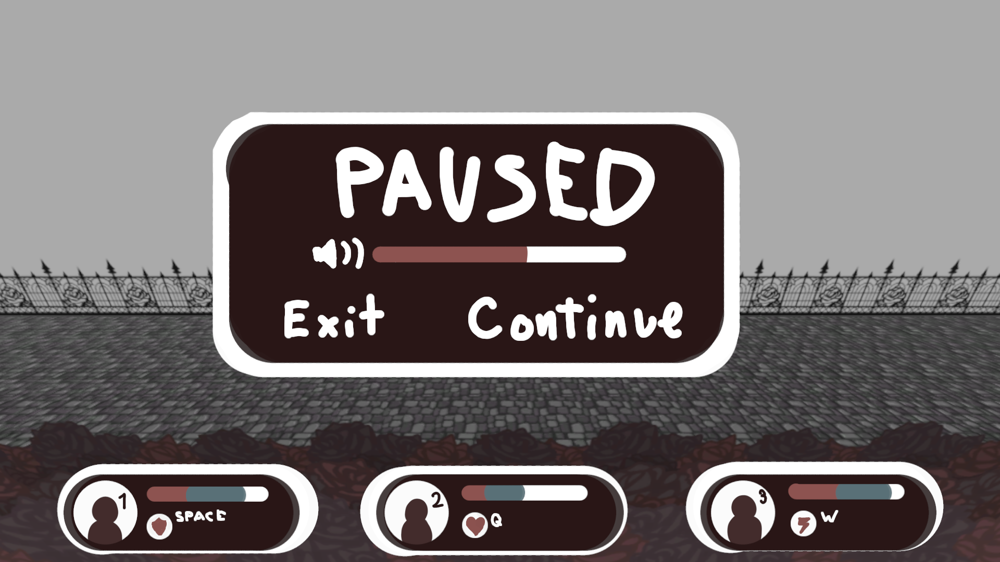

# Final Project

# Magica Project

## ✒️ Description

A 3D Side-scroller where a party of (hopefully) three characters fight enemies using spells and skills that use their health to cast.

## 🕹️ Gameplay

To start, the characters will each have a key that needs to be held down to move them. While holding down this key, the player will have to use the mouse to click on the position they want the character or characters to move. 

All three characters will have a role:
 - The frontline tank who can parry attacks. (Must have)
 - The midline support who can teleport characters. (Optional)
 - The Backline healer who can heal. (Optional)

Each of these characters have unique skills that can each be activated with a different key. Using a skill will make the character take recoverable damage which will passively heal overtime. Upon taking non-recoverable damage, all recoverable damage becomes non-recoverable as well.

If a character runs out of health, they will be downed and can only get up if they are healed by the healer. If all characters are downed, the player loses and will be kicked to the main menu.

The player will have to have to fight enemies that will attack them. If all the enemies in the level are killed, the player wins and will be brought to the menu. The amount of wins will be saved and will work as a multiplier that will give enemies 10% more health and damage per win.

## 📃 Requirements

(Must haves only)
1. The player can start the game from the menu.
2. The player can move each character individually or together.
3. The player can parry using the tank.
4. The player can attack using the tank.
5. The player's characters can be downed.
6. The player can lose the game.
7. The player can Win the game.
8. the player can pause the game.
9. The player can exit the to the main menu from the pause menu.
10. The system can make the enemy move to the closest character.
11. The system can make the enemy attack periodically. 
12. The system can save the amount of wins.

### 🤖 State Diagram

### 🗺️ Class Diagram

### 🧵 Wireframes

-   _Play_ will navigate to the main game.
-   _Exit_ will close the game.

The three bars show character hp, skills and hp.

-   _SoundBar_ will change the volume.
-   _Exit_ will navigate to the main menu.
-   _Continue_ will close the pause menu.

### 🎨 Assets

I used mermaid to make all the diagrams.

#### 🖼️ Images

I'm making all the art. :3

#### ✏️ Fonts

I will use fonts from google fonts.

#### 🔊 Sounds

I'm making the music and the sounds will come from vsts I bought for the music.

### 📚 References

None, I think.
